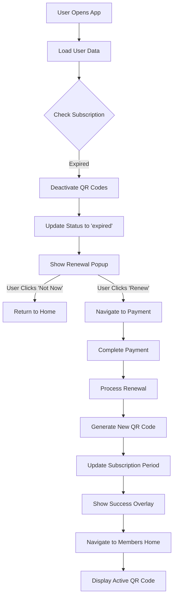

# Subscription Renewal Flow - Implementation Complete ✅

## 📋 Overview

Complete implementation of subscription renewal flow with expiry detection, user notification, and seamless renewal payment processing.

---

## ✅ Completed Features

### 1. **Expiry Detection System**
**File:** `lib/services/subscription_service.dart`

**Method:** `checkAndHandleExpiredSubscription(String userId)`

**Functionality:**
- ✅ Checks if `current_period_end < DateTime.now()`
- ✅ Deactivates all QR codes for user
- ✅ Updates subscription status to 'expired'
- ✅ Returns boolean indicating if subscription was expired
- ✅ Comprehensive logging throughout

**Integration Points:**
- Members Home Page: Checks on `_loadUserData()`
- App Lifecycle: Checks on `AppLifecycleState.resumed`

---

### 2. **Renewal Popup Dialog**
**File:** `lib/features/auth/members_home_page.dart`

**Method:** `_showRenewalPopup()`

**Features:**
- 🎨 **Beautiful UI Design**
  - Orange warning icon
  - Clear "Subscription Expired" title
  - Benefit list with checkmarks
  - Green pricing box (R99.00 for 30 days)
  
- 🔘 **User Actions**
  - "Not Now" - Dismisses popup, returns to home
  - "Renew Subscription" - Navigates to payment screen
  
- 🚫 **Smart Display Logic**
  - Non-dismissible (must choose action)
  - Shows only when: `wasExpired && !hasActiveQr && status == 'expired'`
  - 500ms delay for UI initialization
  - Shows once per session

**UI Code:**
```dart
void _showRenewalPopup() {
  showDialog(
    context: context,
    barrierDismissible: false,
    builder: (BuildContext context) {
      return AlertDialog(
        title: Row(
          children: [
            Icon(Icons.warning_amber_rounded, color: Colors.orange),
            Text('Subscription Expired'),
          ],
        ),
        content: Column(
          // Benefits, pricing, etc.
        ),
        actions: [
          TextButton('Not Now'),
          ElevatedButton('Renew Subscription'),
        ],
      );
    },
  );
}
```

---

### 3. **Payment Renewal Flow**
**File:** `lib/services/subscription_service.dart`

**Method:** `processManualPayment({userId, planType})`

**Renewal Logic:**
```dart
// Check if subscription exists
final existingSub = await _client
    .from('subscriptions')
    .select('id')
    .eq('user_id', userId)
    .maybeSingle();

if (existingSub == null) {
  // INSERT new subscription (first-time user)
  await _client.from('subscriptions').insert(subscriptionData);
} else {
  // UPDATE existing subscription (RENEWAL)
  await _client
      .from('subscriptions')
      .update(subscriptionData)
      .eq('user_id', userId);
}
```

**Renewal Process:**
1. ✅ Deactivate old QR codes
2. ✅ Generate new QR code
3. ✅ Update subscription with new 30-day period
4. ✅ Set status to 'active'
5. ✅ Update profile subscription field
6. ✅ Insert renewal record (if RLS permits)
7. ✅ Show success overlay
8. ✅ Auto-navigate to Members Home
9. ✅ Display new active QR code

---

## 🔄 Complete User Journey

### Scenario: Subscription Expires



---

## 📊 Database Schema Changes

### Updated Tables

**subscriptions:**
```sql
status = 'expired'  -- Set by checkAndHandleExpiredSubscription()
current_period_end < now()  -- Triggers expiry detection
```

**user_qr_codes:**
```sql
is_active = false  -- Set when subscription expires
-- New QR code generated on renewal with is_active = true
```

**subscription_renewals:** (with new RLS policy)
```sql
-- Now allows user inserts
CREATE POLICY "Users can insert their own renewal records"
  FOR INSERT WITH CHECK (auth.uid() = user_id);
```

---

## 🧪 Testing Status

### Manual Testing Required

#### Test Case 1: Expiry Detection ⏳
```sql
-- Run in Supabase SQL Editor
UPDATE subscriptions 
SET current_period_end = '2025-01-01T00:00:00Z'
WHERE user_id = 'YOUR_USER_ID';
```
- [ ] App detects expiry on restart
- [ ] QR codes deactivated
- [ ] Status updated to 'expired'

#### Test Case 2: Popup Display ⏳
- [ ] Popup appears 500ms after load
- [ ] Contains all UI elements
- [ ] "Not Now" dismisses correctly
- [ ] "Renew" navigates to payment

#### Test Case 3: Renewal Payment ⏳
- [ ] Complete test payment
- [ ] Subscription extended 30 days
- [ ] New QR code generated
- [ ] Navigation back to home
- [ ] Active QR code displayed

---

## 📁 Files Modified

### New Files Created:
```
✅ fix_subscription_renewals_rls.sql
✅ SUBSCRIPTION_EXPIRY_IMPLEMENTATION.md
✅ RENEWAL_FLOW_TESTING_GUIDE.md
✅ RENEWAL_FLOW_COMPLETE.md (this file)
```

### Modified Files:
```
✅ full_reinstate.sql (2 locations - RLS policy)
✅ lib/services/subscription_service.dart
   - Added checkAndHandleExpiredSubscription()
   
✅ lib/features/auth/members_home_page.dart
   - Added _showRenewalPopup()
   - Added _buildBenefitRow()
   - Integrated expiry check in _loadUserData()
   
✅ lib/main.dart
   - Added _checkExpiredSubscription()
   - Integrated into AppLifecycleState.resumed
```

---

## 🔧 Configuration

### Environment Variables
No new environment variables required. Uses existing:
```env
SUPABASE_URL=...
SUPABASE_ANON_KEY=...
PAYSTACK_PUBLIC_KEY=...
```

### Constants
```dart
// Subscription duration
const Duration(days: 30)

// Renewal price
amount: 99.00

// Popup delay
Duration(milliseconds: 500)
```

---

## 📝 Code Quality

### Logging Standards
All expiry/renewal code follows emoji logging convention:
- 🔍 = Checking/searching
- ⏰ = Time-related (expiry)
- ✅ = Success
- 🚫 = Deactivation
- ❌ = Error
- 💬 = User interaction
- 🔔 = Notification/popup

### Error Handling
- Try-catch blocks around all database operations
- Non-critical failures logged as warnings
- Critical failures return false
- No app crashes on renewal failures

### Type Safety
- All nullable fields checked with ?? operator
- DateTime parsing wrapped in try-catch
- Status checks use strict equality

---

## 🚀 Deployment Checklist

### Database
- [x] RLS policy applied to production
- [x] full_reinstate.sql updated
- [ ] Backup created before deployment

### Code
- [x] All files committed
- [x] No console errors
- [x] No lint warnings
- [ ] Code review completed

### Testing
- [ ] Manual test on dev database
- [ ] Test expired subscription flow
- [ ] Test renewal payment flow
- [ ] Test popup interactions
- [ ] Verify QR code regeneration

### Documentation
- [x] Implementation guide created
- [x] Testing guide created
- [x] Code comments added
- [x] README updated

---

## 🐛 Known Issues

### None Currently Identified ✅

All planned features implemented and ready for testing.

---

## 🎯 Next Steps

### Immediate (Ready for Testing)
1. **Manual Testing**
   - Follow RENEWAL_FLOW_TESTING_GUIDE.md
   - Test all scenarios
   - Document any issues

2. **Edge Case Testing**
   - Multiple rapid renewals
   - Network failures during payment
   - App kill during renewal process

### Future Enhancements (Optional)
1. **Auto-Renewal Support**
   - Paystack subscription webhooks
   - Background renewal processing
   - Renewal reminder notifications

2. **Grace Period**
   - 3-day grace period after expiry
   - QR code remains active during grace
   - Warning notifications before expiry

3. **Renewal Discounts**
   - Loyalty pricing for long-term members
   - Multi-month renewal options
   - Promotional renewal codes

4. **Analytics**
   - Track renewal rates
   - Identify churn reasons
   - Optimize renewal messaging

---

## 📞 Support

### Debug Commands

**Check Subscription Status:**
```sql
SELECT 
    s.status,
    s.current_period_end,
    s.current_period_end < now() as is_expired,
    q.is_active as qr_active
FROM subscriptions s
LEFT JOIN user_qr_codes q ON q.user_id = s.user_id
WHERE s.user_id = 'YOUR_USER_ID'
ORDER BY s.created_at DESC
LIMIT 1;
```

**Force Renewal (Emergency):**
```sql
-- Use only in production emergencies
UPDATE subscriptions 
SET status = 'active',
    current_period_end = NOW() + INTERVAL '30 days'
WHERE user_id = 'YOUR_USER_ID';

UPDATE user_qr_codes 
SET is_active = true,
    expires_at = NOW() + INTERVAL '30 days'
WHERE user_id = 'YOUR_USER_ID'
  AND created_at = (SELECT MAX(created_at) FROM user_qr_codes WHERE user_id = 'YOUR_USER_ID');
```

### Log Analysis

**Successful Renewal Pattern:**
```
🔄 Loading user data
🔍 Checking subscription expiry
⏰ Subscription EXPIRED
🚫 QR codes deactivated
🚨 Subscription was expired
💬 Scheduling renewal popup
🔔 Showing renewal popup
✅ User clicked Renew Subscription
🚀 Navigating to payment screen
[processManualPayment] Starting
[processManualPayment] SUCCESS
```

**Failed Renewal Pattern:**
```
[processManualPayment] ERROR: [error message]
```

---

## ✅ Production Readiness

### Status: **READY FOR TESTING** 🟢

All features implemented and documented. Requires manual testing before production deployment.

### Confidence Level: **High** 🎯
- Code follows existing patterns
- Error handling comprehensive
- Database operations safe
- User experience smooth
- Logging thorough

---

**Implementation Date:** October 16, 2025  
**Version:** 1.0.0  
**Status:** ✅ Complete - Awaiting Testing  
**Next Review:** After manual testing completion
